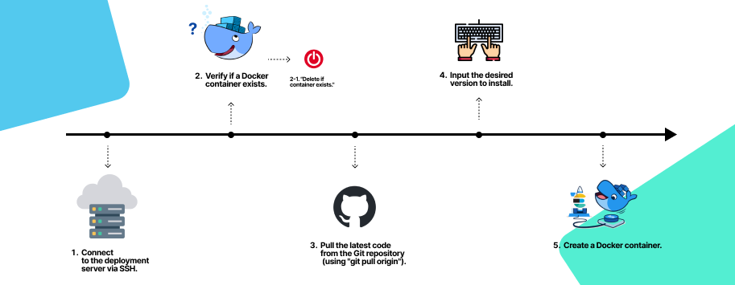
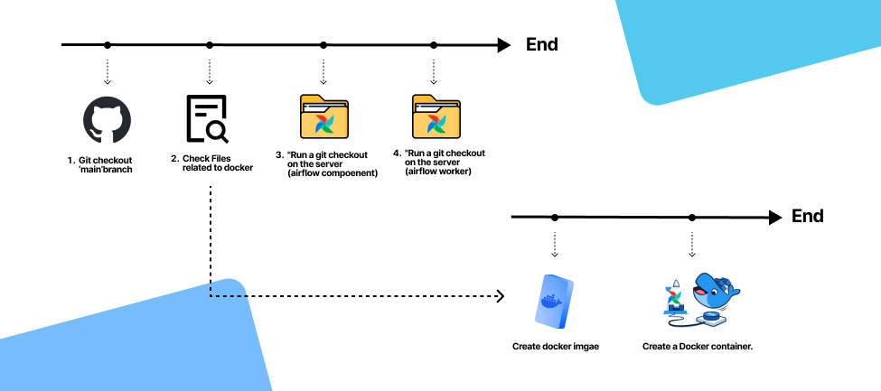

# Repository Overview

This repository is developed to automate the setup of repetitive open-source environments, such as Elasticsearch and Apache Airflow, using Jenkins pipelines.

## Elasticsearch Environment Automation

### Deployment Options

Elasticsearch can be deployed in three different configurations, as defined in the [reference repository](https://github.com/cucuridas/elasticsearch_deploy):

1. Single
2. Master-slave
3. Raft-cluster

### Deployment Process

The deployment process for Elasticsearch is as follows:

1. Connect to the target server where deployment is intended.
2. Check if Elasticsearch is already deployed using Docker containers.

   - If running containers exist, stop them.

3. Perform a `git pull` on the deployment server to fetch the YAML files defined in the repository.
4. Input the desired Elasticsearch configuration (Single, Master-slave, Raft-cluster).
5. Create the necessary Docker containers based on the chosen configuration.

## Apache Airflow Environment Automation

In the case of Apache Airflow, both source code version control and environment setup management are performed within a pipeline using the [referenced repository](https://github.com/cucuridas/airflow_deploy).

1. Download the GitHub repository to the Jenkins server, adding any plugins if necessary.
2. Check if there are changes in the configuration of the environment setup (related to Docker).
   
   - If there are changes, build the Docker image after completion of step 4.
   - Recreate Docker containers (this operation is carried out for both the component and worker servers).

3. Download the repository to the server intended for Airflow components.
4. Download the repository to the server intended for Airflow workers.
